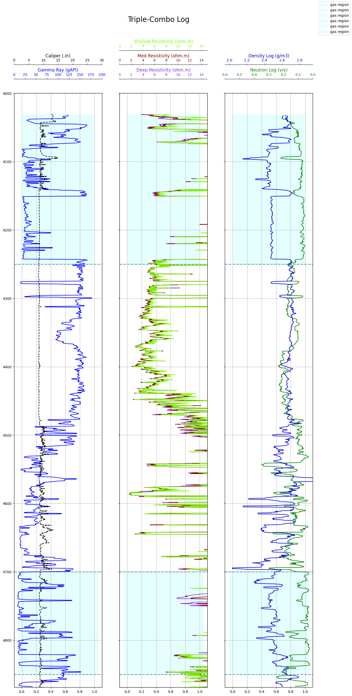
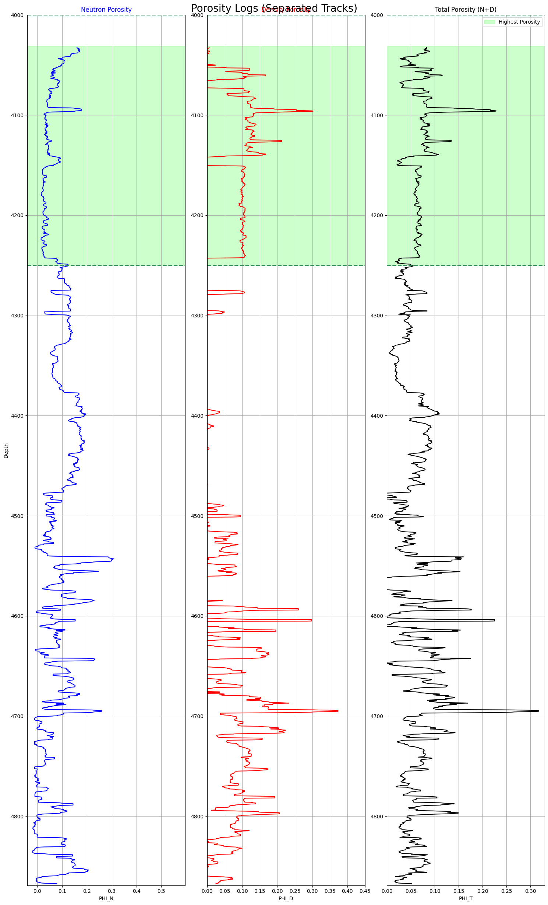
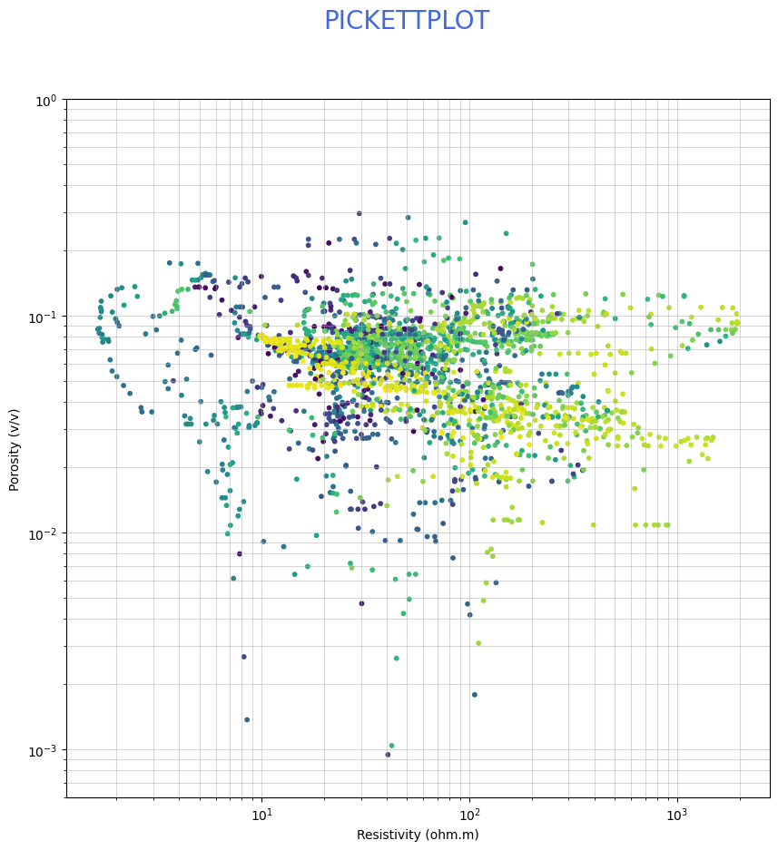
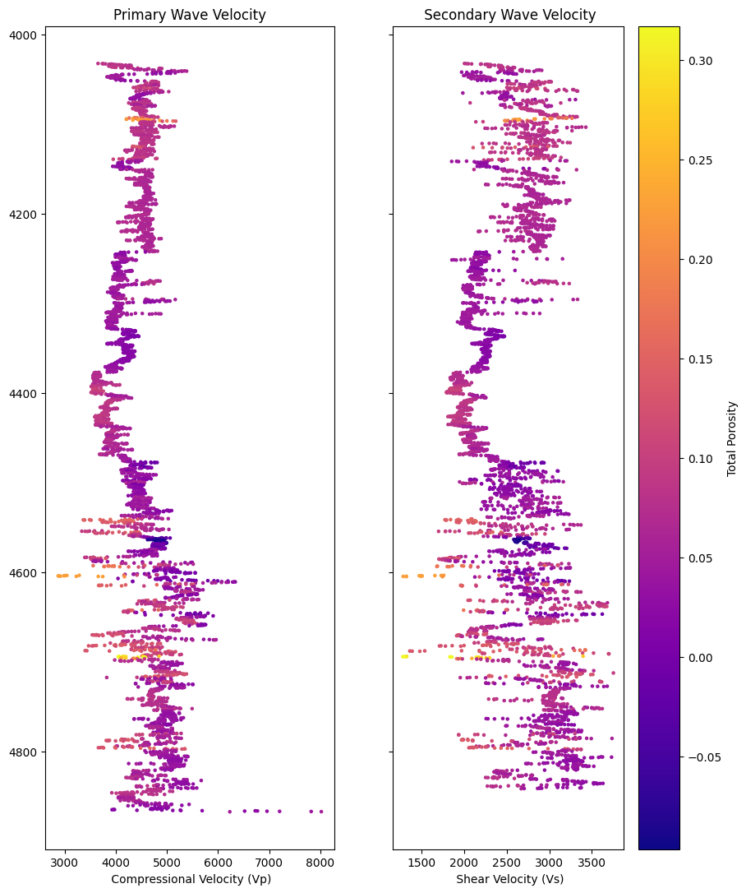

# Well Log Analysis using Python


## Overview

This repository demonstrates a Python-based workflow for processing, analyzing, and visualizing LAS well log data. The implementation highlights scientific computing techniques using Python to transform raw well log measurements into meaningful visualizations and derived petrophysical properties.

The project emphasizes data preprocessing, visualization, and analytical workflows built with open-source Python libraries.

## Features

- Import LAS well log files.
- Perform data preprocessing and cleaning.
- Handle missing values.
- Generate Triple Combo plots.
- Calculate porosity.
- Create Pickett plots.
- Compute acoustic impedance.
- Analyze velocity logs.
- Generate synthetic seismic responses.

## Technology Stack

- **Python**
- **Pandas**
- **NumPy**
- **Matplotlib**
- **Seaborn**
- **Lasio**
- **Jupyter Notebook**

## About

This repository presents the software implementation developed as part of a team-based academic case study.

### My Contributions

- Refined and improved the Python workflow.
- Debugged and optimized the notebook.
- Enhanced data preprocessing.
- Improved visualization quality.
- Organized documentation for GitHub.

## Repository Structure

```text
well-log-analysis-python
│
├── data/
│   └── ichthys_deep_1_welldata.las
│
├── notebooks/
│   └── well_log_analysis.ipynb
│
├── plots/
│   ├── Triple Combo Log.png
│   ├── Porosity Logs.png
│   ├── Pickett Plot.png
│   ├── Impedance Plot.png
│   ├── Velocity Plots.png
│   └── Seismic Plots.png
│
├── README.md
├── requirements.txt
```

## How to Run

### Clone the repository

```bash
git clone https://github.com/<your-github-username>/well-log-analysis-python.git
```

### Install dependencies

```bash
pip install -r requirements.txt
```

### Launch Jupyter Notebook

```bash
jupyter notebook
```

Open:

```text
well_log_project.ipynb
```

Run all cells sequentially to reproduce the analysis and visualizations.

### Triple Combo Plot

Integrated visualization of Gamma Ray, Resistivity, Density, and Neutron logs generated using Matplotlib.



### Porosity plots
Visualization of density porosity, neutron porosity, and total porosity



### Pickett Plot



### Velocity Plot
 

## Future Improvements

- Refactor notebook code into reusable Python modules.
- Build an interactive Streamlit dashboard.
- Add support for processing multiple LAS files.
- Implement automated report generation.
- Improve code modularity and documentation.


